# Diagramas del Agente de Reclamos Técnicos — "Sofía"

Este documento contiene diagramas que ilustran la arquitectura, flujos y componentes del sistema de gestión de reclamos técnicos.

**Última actualización**: Marzo 2026

---

## 1. Diagrama de Flujo Principal

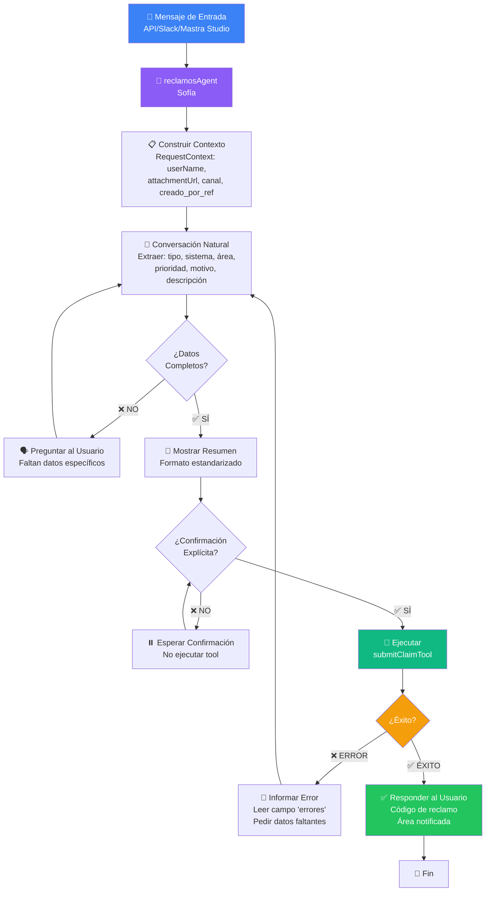

---

## 2. Arquitectura del Sistema

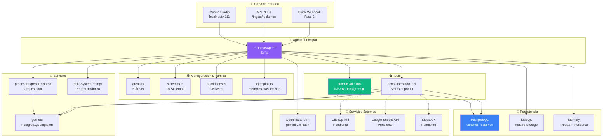

---

## 3. Diagrama de Secuencia — Registro de Reclamo

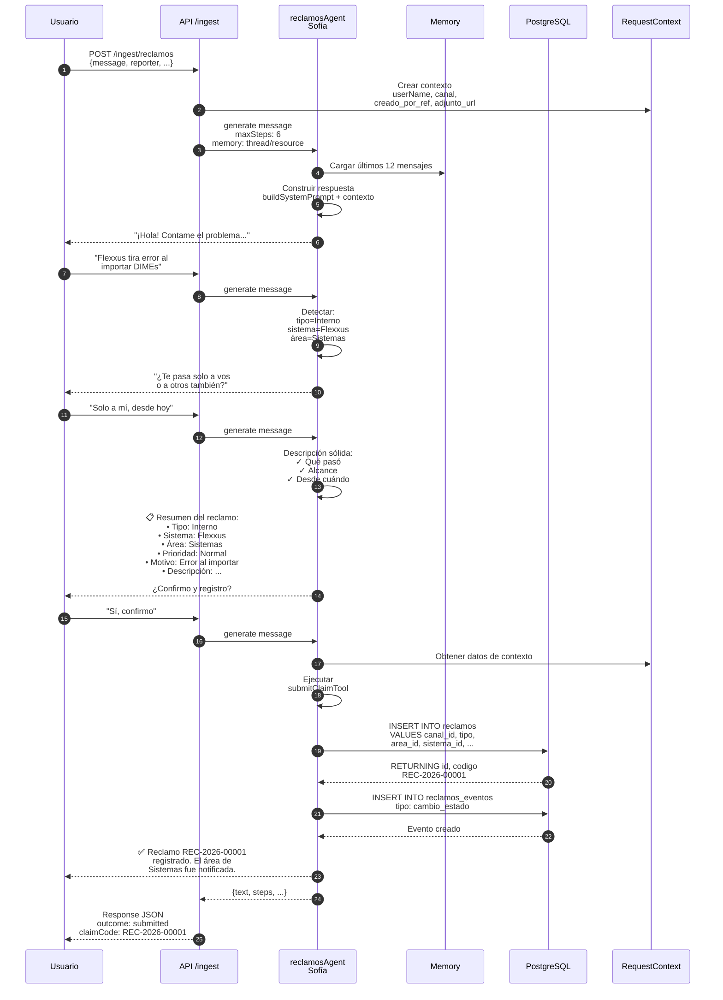

---

## 4. Diagrama de Estados del Reclamo

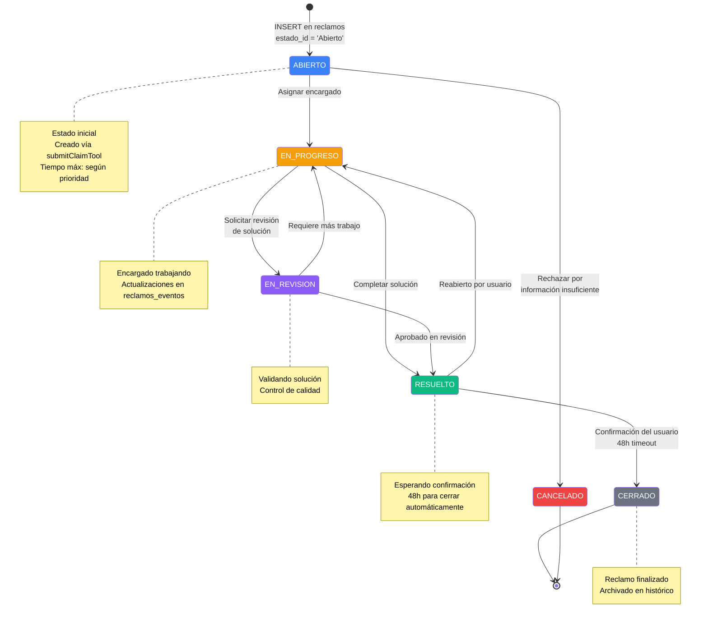

---

## 5. Diagrama de Componentes

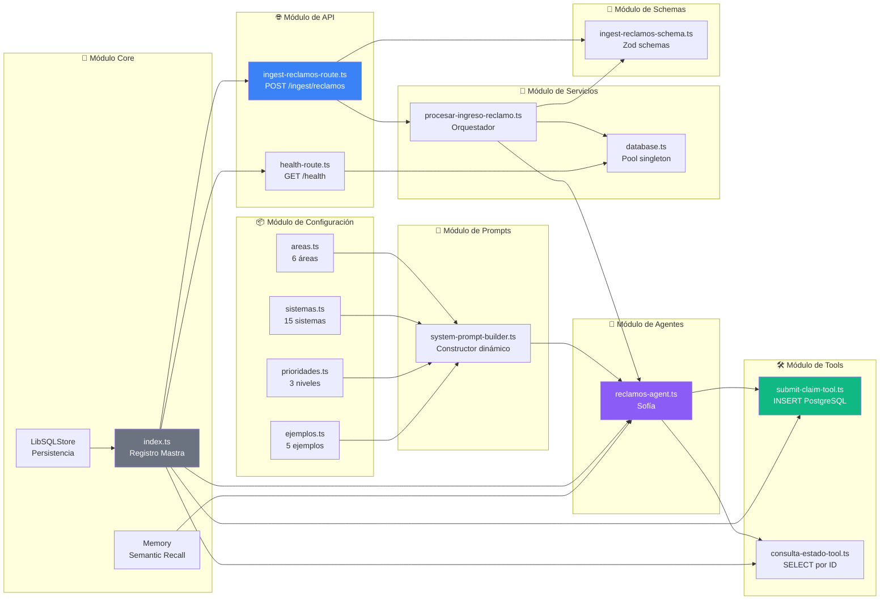

---

## 6. Flujo de Construcción de Descripción Sólida

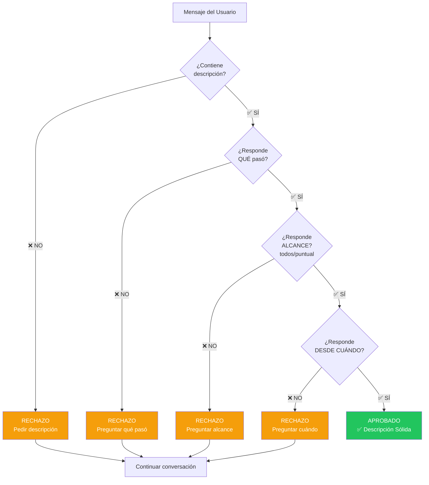

---

## 7. Arquitectura de RequestContext

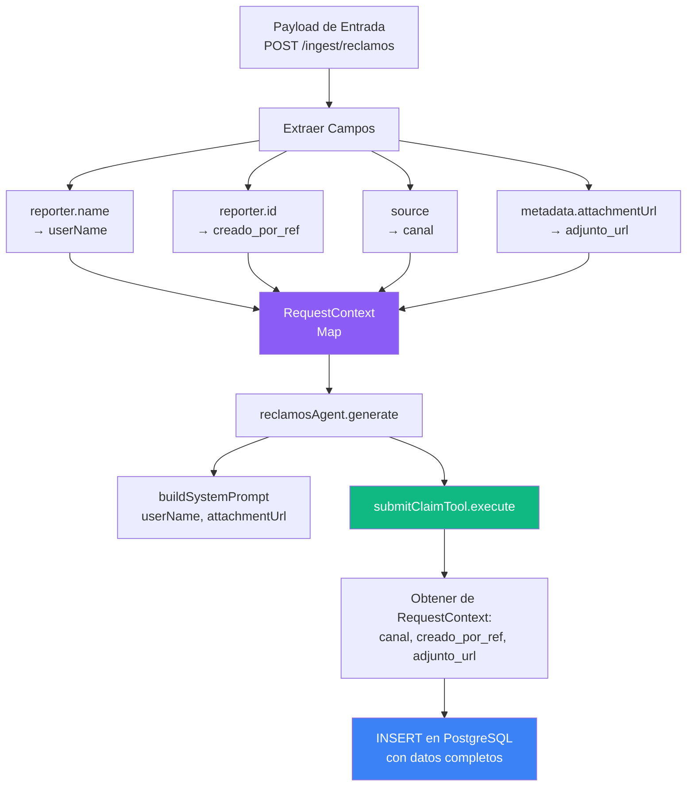

---

## 8. Diagrama de Despliegue

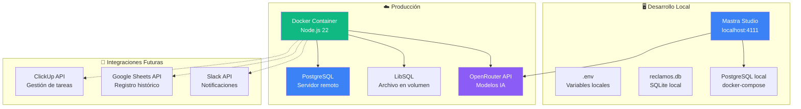

---

## 9. Matriz de Decisión de Prioridad

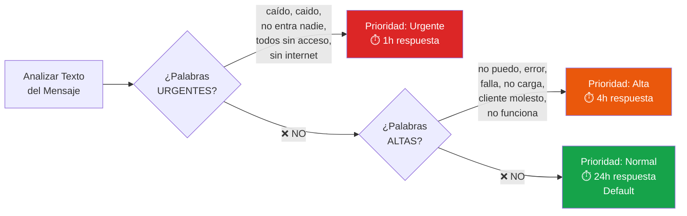

---

## 10. Timeline de Procesamiento

```mermaid
gantt
    title Timeline de Procesamiento de Reclamo
    dateFormat X
    axisFormat %L ms

    section Recepción
    Recepción del Mensaje : 0, 50
    Parseo y Validación : 50, 100
    Crear RequestContext : 100, 150

    section Conversación
    Cargar Memoria : 150, 250
    Generar Respuesta IA : 250, 1500
    Enviar al Usuario : 1500, 1600

    section Confirmación
    Esperar Respuesta : 1600, 5000
    Validar Confirmación : 5000, 5100

    section Registro
    Ejecutar submitClaimTool : 5100, 5200
    INSERT en PostgreSQL : 5200, 5400
    INSERT evento : 5400, 5500

    section Respuesta
    Generar Confirmación : 5500, 5600
    Enviar al Usuario : 5600, 5700

    section Total
    Tiempo Total : 0, 5700
```

---

## 11. Flujo de Memoria Conversacional

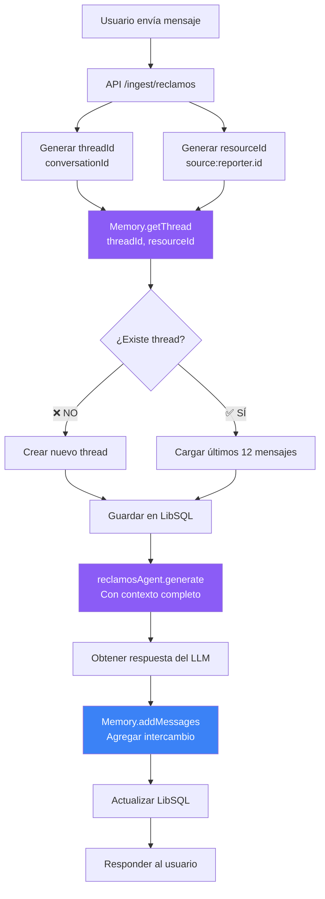

---

## 12. Arquitectura de Base de Datos

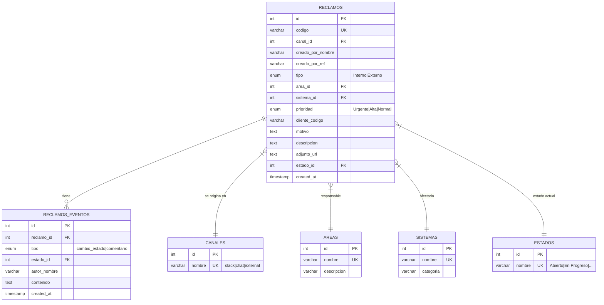

---

## Leyenda

| Símbolo | Significado |
|---------|-------------|
| ✅ | Aprobado / Exitoso |
| ❌ | Rechazado / Error |
| ⚠️ | Advertencia / Atención |
| 📋 | Construcción/Consulta |
| 🔍 | Búsqueda/Análisis |
| 🚀 | Ejecución/Acción |
| 💬 | Comunicación |
| 📊 | Registro/Datos |
| 📌 | Tarea/Asignación |
| 🧠 | IA/Procesamiento |
| 📚 | Configuración/Contexto |
| 💾 | Persistencia/Storage |
| 🌐 | API/HTTP |

---

## Historial de Cambios

| Fecha | Versión | Cambios |
|-------|---------|---------|
| 2026-03-09 | 2.0 | Actualización completa: arquitectura Mastra, PostgreSQL, API REST |
| 2024-XX-XX | 1.0 | Versión inicial con mocks |
